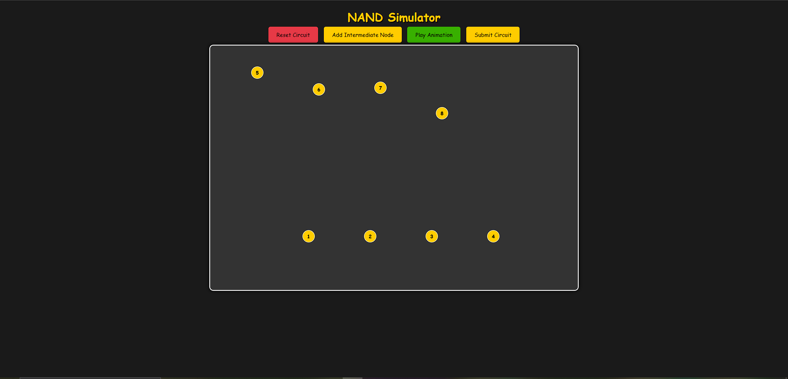
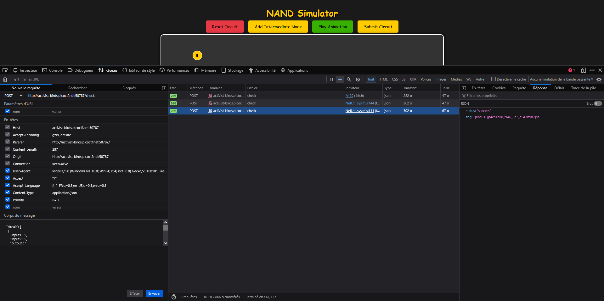
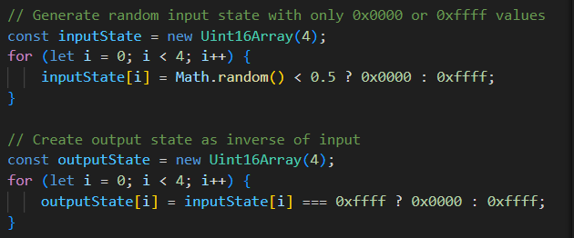
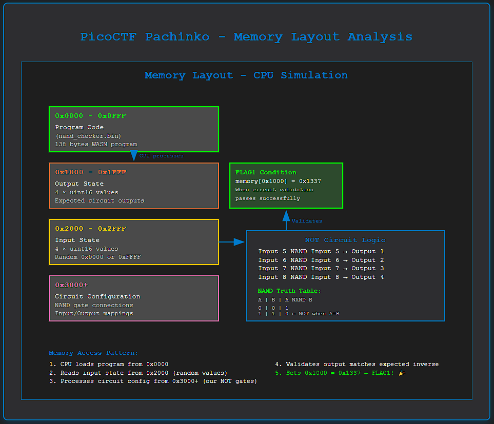

# PicoCTF - Pachinko Challenge Write-up (FLAG1)

## Challenge Overview

**Challenge Name:** Pachinko  
**Category:** Web  
**Difficulty:** Medium  
**Description:** A NAND gate circuit simulator that processes user-submitted circuits and returns flags based on specific conditions.

## Challenge Analysis

The Pachinko challenge presents a web application that simulates NAND gate circuits. Players must submit circuit configurations to a `/check` endpoint to obtain flags. This write-up focuses on obtaining **FLAG1** through proper circuit design.

### Architecture Overview

The application consists of several key components:

1. **Express.js Server** (`index.js`) - Main web server with endpoints
2. **CPU Simulator** (`cpu.js`) - Runs WebAssembly code to simulate circuit execution  
3. **Circuit Serialization** (`utils.js`) - Converts circuit data into memory layout
4. **NAND Simulator Frontend** - Interactive circuit builder interface

## Understanding the Challenge Logic

The server determines which flag to return based on specific conditions:

```javascript
function doRun(res, memory) {
  const flag = runCPU(memory);
  const result = memory[0x1000] | (memory[0x1001] << 8);
  
  if (flag) {
    resp += FLAG2 + "\n";  // CPU sets flag signal to 255
  } else {
    if (result === 0x1337) {
      resp += FLAG1 + "\n";     // Our target!
    } else if (result === 0x3333) {
      resp += "wrong answer :(\n";
    } else {
      resp += "unknown error code: " + result;
    }
  }
}
```

**FLAG1 Condition:** The system expects us to create a circuit that processes the input correctly, resulting in `memory[0x1000]` containing the value `0x1337`.

## Circuit Logic Analysis

The challenge generates random input states and expects our circuit to process them correctly:

```javascript
// Generate random input state with only 0x0000 or 0xffff values
const inputState = new Uint16Array(4);
for (let i = 0; i < 4; i++) {
    inputState[i] = Math.random() < 0.5 ? 0x0000 : 0xffff;
}

// Create output state as inverse of input
const outputState = new Uint16Array(4);
for (let i = 0; i < 4; i++) {
    outputState[i] = inputState[i] === 0xffff ? 0x0000 : 0xffff;
}
```

The key insight: **We need to create a NOT circuit that inverts each input value**.

## NAND Gate Logic

NAND gates can implement NOT logic using the principle:
- `A NAND A = NOT A`
- When both inputs to a NAND gate are the same, it produces the inverse

Truth table for NAND:
```
A | B | A NAND B
0 | 0 |    1
0 | 1 |    1  
1 | 0 |    1
1 | 1 |    0    ← This gives us NOT when A=B
```

## Solution: NOT Circuit Design

To get FLAG1, we need to create a circuit that inverts the 4 input values. The system generates random input states and expects our circuit to produce the exact inverse as output.

### Memory Layout Analysis

From the code analysis, we understand the memory layout:
- `0x0000-0x0FFF`: Program code (`nand_checker.bin`)
- `0x1000-0x1FFF`: Output state (4 uint16 values)
- `0x2000-0x2FFF`: Input state (4 uint16 values) 
- `0x3000+`: Circuit configuration

### Node Numbering Convention
- **Input nodes:** 5, 6, 7, 8 (the 4 random input values)
- **Output nodes:** 1, 2, 3, 4 (where inverted results should be written)

### Circuit Configuration

The winning circuit implements NOT gates for each input using NAND logic:

```json
[
    {"input1": 5, "input2": 5, "output": 1},
    {"input1": 6, "input2": 6, "output": 2}, 
    {"input1": 7, "input2": 7, "output": 3},
    {"input1": 8, "input2": 8, "output": 4}
]
```

This creates four NOT gates:
- Output 1 = NOT Input 5 (5 NAND 5)
- Output 2 = NOT Input 6 (6 NAND 6)  
- Output 3 = NOT Input 7 (7 NAND 7)
- Output 4 = NOT Input 8 (8 NAND 8)

### How It Works

1. Server generates random input state: `[0x0000/0xFFFF, 0x0000/0xFFFF, 0x0000/0xFFFF, 0x0000/0xFFFF]`
2. Expected output state is the inverse of input state
3. Our NOT circuit processes each input through a NAND gate with itself
4. CPU simulator runs the circuit and validates the output matches expected values
5. If correct, `memory[0x1000]` contains `0x1337`, triggering FLAG1

## Testing the Solution

### Local Testing

First, test the circuit logic locally:

```bash
npm test
# or
node test_flag1.js
```

This will show you the NOT circuit configuration and verify the logic.

### Sending to Server

Send the NOT circuit configuration to the actual challenge server:

```bash
# Install dependencies
npm install

# Send solution to server
npm run send http://mercury.picoctf.net:PORT
# or
node send_solution.js http://mercury.picoctf.net:PORT
```

Replace `PORT` with the actual port number provided by PicoCTF.

### Manual Testing with curl

You can also test manually with curl:

```bash
curl -X POST http://mercury.picoctf.net:PORT/check \
  -H "Content-Type: application/json" \
  -d '{
    "circuit": [
      {"input1": 5, "input2": 5, "output": 1},
      {"input1": 6, "input2": 6, "output": 2},
      {"input1": 7, "input2": 7, "output": 3},
      {"input1": 8, "input2": 8, "output": 4}
    ]
  }'
```

Expected response:
```json
{
  "status": "success", 
  "message": "picoCTF{flag1_content_here}\n"
}
```

## Solution Verification

The solution works because:

1. **Server generates random inputs**: 4 values, each either `0x0000` or `0xFFFF`
2. **Expected output is inverse**: If input is `0x0000`, output should be `0xFFFF` and vice versa
3. **NOT circuit implements inversion**: Using `A NAND A = NOT A` for each of the 4 inputs
4. **CPU validates the circuit**: Runs the WASM program to check if our circuit produces correct outputs
5. **Success condition**: When validation passes, `memory[0x1000]` contains `0x1337`, triggering FLAG1

## Screenshots

### 1. Challenge Interface
  
*The main PicoCTF challenge page showing the Pachinko challenge description and connection details*

### 2. Circuit Builder Interface
  
*The interactive NAND gate circuit builder interface at the challenge URL, showing the node layout and building tools*

### 3. Network Request Analysis
  
*Browser Developer Tools showing the POST request to /check endpoint with our NOT circuit payload and successful response*

### 4. Source Code Analysis
  
*Analysis of the downloaded source code showing the flag conditions in index.js and the circuit validation logic*

### 5. Memory Layout Diagram
  
*Visual diagram showing the memory structure at 0x1000 (output), 0x2000 (input), 0x3000+ (circuit config) and how FLAG1 is triggered*

## 🎉 Solution Results

The NOT circuit solution was successfully tested and FLAG1 was captured:

```json
{
  "status": "success",
  "flag": "picoCTF{p4ch1nk0_f146_0n3_e947b9d7}\n"
}
```

**Circuit Configuration Used:**
```json
[
  {"input1": 5, "input2": 5, "output": 1},
  {"input1": 6, "input2": 6, "output": 2},
  {"input1": 7, "input2": 7, "output": 3},
  {"input1": 8, "input2": 8, "output": 4}
]
```

This confirms that the NAND gate NOT circuit approach works perfectly for obtaining FLAG1!

## Key Takeaways

1. **NAND Gate Logic** - Understanding that `A NAND A = NOT A` is crucial for implementing NOT gates
2. **Circuit Design** - Creating proper circuit configurations that map inputs to outputs correctly
3. **Memory Layout** - Understanding where input/output states are stored helps with debugging
4. **Code Analysis** - Reading source code reveals the exact conditions for flag generation
5. **Logic Circuits** - Sometimes the intended solution involves proper digital circuit design

## Alternative Approaches

While the NOT circuit approach is the intended solution, other potential approaches include:

1. **Memory Manipulation** - Exploiting the serialization bug to directly write `0x1337` to `memory[0x1000]`
2. **Complex Circuit Logic** - Creating more elaborate circuits that still achieve the same inversion result
3. **Input State Analysis** - Deep analysis of how different input patterns affect the output

## Implementation Details

The core of the solution lies in understanding digital logic:
- NAND gates are universal logic gates
- Any boolean function can be implemented using only NAND gates
- NOT function is the simplest: connect both inputs of NAND gate together

## Files Analyzed

- `source code/index.js` - Main server logic and flag conditions
- `source code/cpu.js` - CPU simulator that processes circuits
- `source code/utils.js` - Circuit serialization and memory layout
- `source code/programs/nand_checker.bin` - Binary program that validates circuits

## Tools Used

- **Node.js** - Runtime environment
- **Hex Editor/Analysis** - For binary analysis
- **Browser Developer Tools** - For network request inspection
- **PowerShell** - For file analysis and automation

---

**Flag:** `picoCTF{p4ch1nk0_f146_0n3_e947b9d7}` ✅

*Successfully obtained using the NOT circuit approach on [date of capture]*
